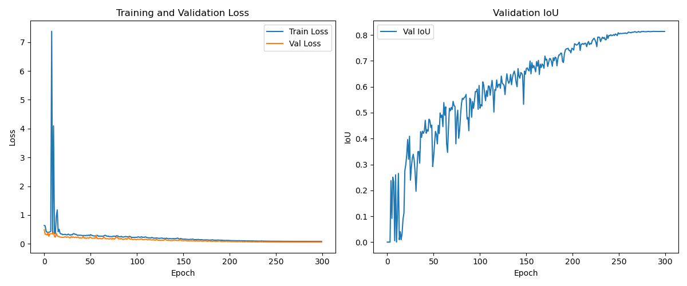
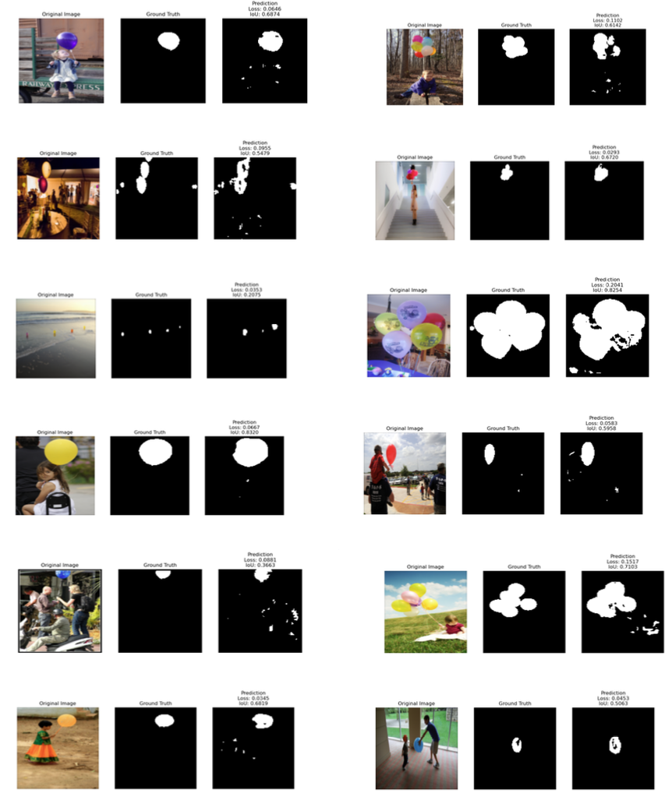
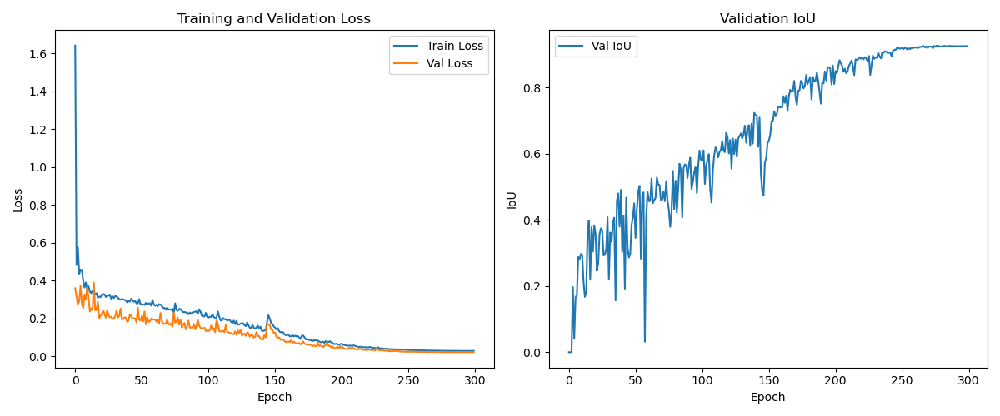
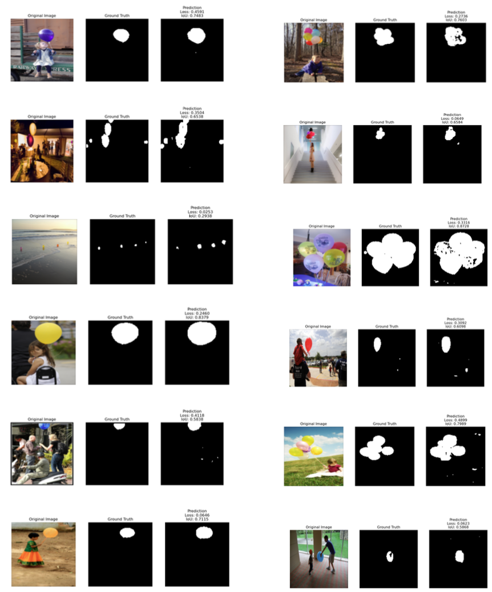
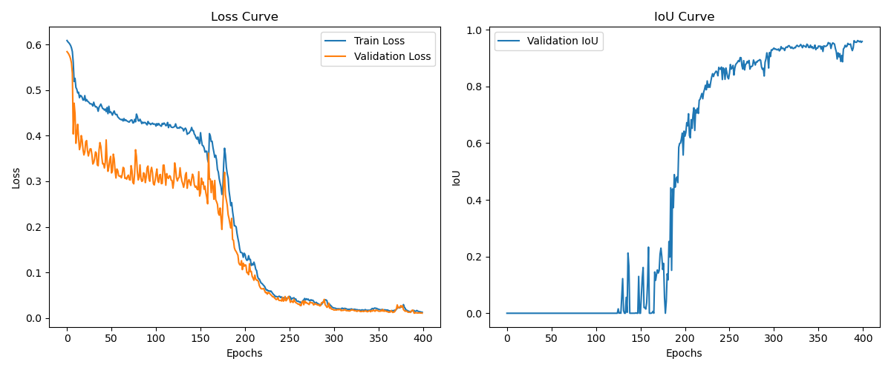
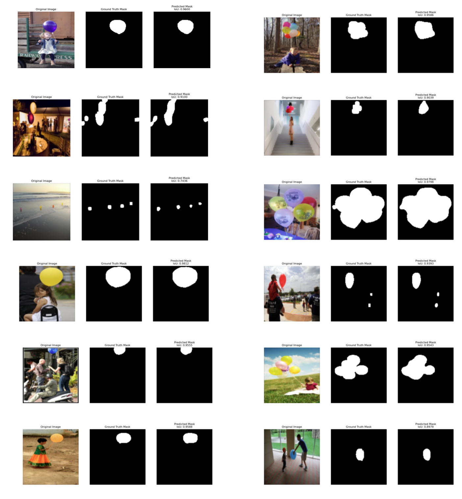

# U-Net Balloon Segmentation Project

## 1. Background

This project aims to address the problem of balloon image segmentation by utilizing deep learning techniques to automatically identify and segment balloon regions within images. Image segmentation is a fundamental task in computer vision, widely applied in fields such as autonomous driving and medical image analysis. The core objective of this experiment is to train a **U-Net model** to achieve high-precision segmentation of balloon regions.

## 2. Theoretical Principles

### 2.1 U-Net Architecture

The model adopts the U-Net network structure, a classic architecture based on the Encoder-Decoder framework:

* **Encoder:** Extracts image features and reduces spatial resolution through convolution and pooling operations.
* **Decoder:** Restores image dimensions through upsampling and combines feature maps from the encoder (Skip Connections) to retain detailed information.
* **Output:** Generates a mask consistent with the original image size to classify whether pixels belong to a "balloon."

### 2.2 Evaluation Metric

This project uses **IoU (Intersection over Union)** as the primary evaluation metric to measure the overlap between the predicted region and the ground truth region.

The calculation formula is:

$$IoU=\frac{Predictioin\cap GroundTruth}{Predictioin\cup GroundTruth}$$

The experiment requires the average IoU on the test set to reach **above 0.9**.

## 3. Dataset

* **Source:** Balloon Dataset.
* **Quantity:** A total of 74 sample images.
* **Training Set:** 61 images.
* **Test Set:** 13 images.

* **Format:**
* Input: Images in RGB format.
* Labels: Balloon region masks annotated in polygon format.

## 4. Training Process & Implementation

### 4.1 Preprocessing

* **Resize:** Adjusts images and masks to a unified input size.
* **Normalization:** Normalizes image pixel values (divides by 255.0) and converts them to Tensors.
* **Caching:** To improve reading efficiency, `np.savez_compressed` is used to save processed images and masks as cache files.

### 4.2 Configuration

* **Model Structure:** Custom `UNetModel` class with 3 input channels.
* **Epochs:** 300.
* **Optimization Strategy:** Uses the `CosineAnnealingLR` learning rate scheduler to dynamically adjust the learning rate (`eta_min=1e-6`) for optimized convergence.
* **Loss Function:** Focuses on the Jaccard Index (IoU) suitable for binary classification tasks.

### 4.3 Core Logic

* **Training Loop:** Calculates Loss and IoU in each Epoch and saves the best model weights (`best_model.pth`).
* **Prediction:** Implements a `predict` function to load the model and generate binary prediction masks for the test set.

## 5. Experiment Process: Hyperparameter Tuning and Model Optimization

To improve the segmentation accuracy (IoU) of the U-Net model on balloon regions and accelerate convergence, we conducted multiple experiments and adjustments on core hyperparameters such as learning rate, batch size, and optimization strategy. The detailed tuning process is recorded below:

### 5.1 Baseline Configuration
Initially, we established a baseline model with conservative parameter settings to verify code connectivity.
* **Optimizer**: Adam
* **Initial Learning Rate**: $1 \times 10^{-4}$ (Fixed)
* **Batch Size**: 1
* **Epochs**: 300
* **Loss Function**: BCELoss (Binary Cross Entropy Loss)

**Issues with Baseline:**
Due to the small Batch Size (only 1), the gradient oscillated severely during training, leading to an unstable Loss curve. Additionally, the fixed learning rate made it difficult for the model to converge further in the later stages, easily getting stuck in local optima with slow improvement in validation IoU.

### 5.2 Learning Rate Strategy Optimization
To address the convergence difficulty in later stages, we introduced a dynamic learning rate adjustment mechanism.
* **Strategy**: Switched from a fixed learning rate to a **Cosine Annealing LR Scheduler**.
* **Implementation**: Used `torch.optim.lr_scheduler.CosineAnnealingLR`.
    * **Initial Learning Rate**: Adjusted to $1 \times 10^{-3}$ to accelerate early convergence.
    * **Minimum Learning Rate (eta_min)**: Set to $1 \times 10^{-6}$ to ensure fine-grained search for the optimal solution with minimal steps in the later stages.
    * **Period (T_max)**: Set to 300, consistent with the total number of Epochs.

**Optimization Effect:**
After introducing the scheduler, the learning rate decreased in a cosine function pattern with Epochs. Experiments showed that the Loss curve became smoother in the later stages, and the validation IoU stably broke through the 0.9 bottleneck.

### 5.3 Batch Size & Efficiency Adjustment
* **Adjustment**: Increased `Batch Size` from **1** to **32**.
* **Reasons**:
    1.  The dataset images are resized to $128 \times 128$, occupying little GPU memory. Increasing Batch Size fully utilizes GPU parallel computing capabilities.
    2.  A larger Batch Size provides more accurate gradient estimation, reducing random noise during training and clarifying the model convergence direction.
* **Data Loading Optimization**: To accommodate the larger Batch Size and reduce I/O bottlenecks, we added a caching mechanism (`use_cache=True`) in `BalloonDataset`. This saves preprocessed images and masks as `.npz` files, significantly reducing the time consumption per Epoch.

### 5.4 Final Configuration
After the above tuning, the determined optimal hyperparameter combination is as follows:

| Parameter | Final Value | Note |
| :--- | :--- | :--- |
| **Model Structure** | U-Net (3-layer Encoder/Decoder) | Input Channels: 3, Output Channels: 1 |
| **Input Size** | $128 \times 128$ | Resize & Normalize |
| **Optimizer** | Adam | Default momentum |
| **LR Strategy** | CosineAnnealingLR | $10^{-3} \to 10^{-6}$ |
| **Batch Size** | 32 | |
| **Epochs** | 400 | IoU stabilizes after approx. 150 epochs |
| **Loss Function** | BCELoss | Monitored with Jaccard Index |

Under this configuration, the model finally achieved an average IoU of over **0.9** on the test set, and the Loss curve (as shown in Figure 1) demonstrated good convergence without obvious overfitting.

## 6. Results

According to the experiment requirements, the project outputs the following visualizations:

1. **Loss Curve:** plots the decline of Loss during training to observe model convergence.
2. **Segmentation Comparison:** Uses Matplotlib to draw comparison plots containing the following three parts:
* **Image:** The original input image.
* **Ground Truth:** The actual annotated mask.
* **Prediction:** The segmentation result predicted by the model.

The final model aims to achieve the high-precision segmentation standard (>0.9 average IoU) on the test set.
